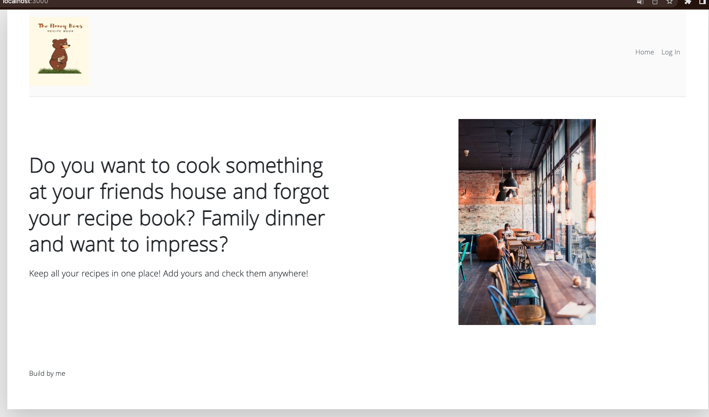
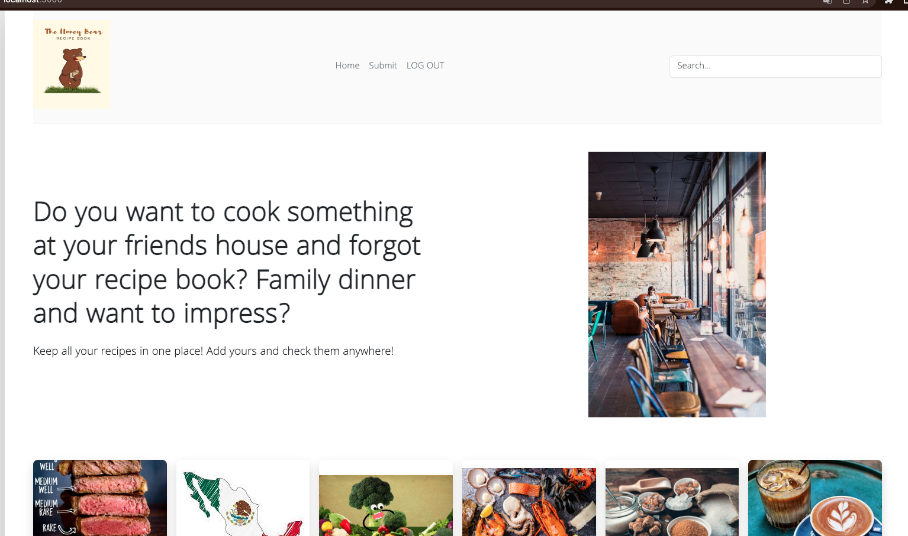
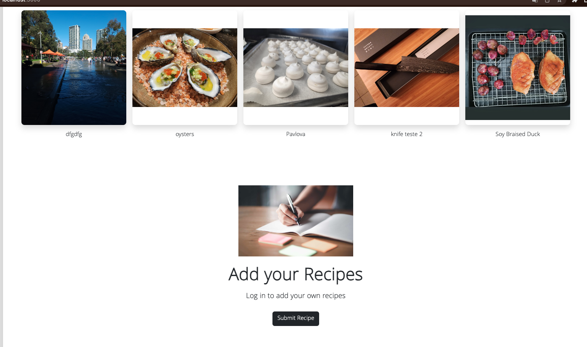
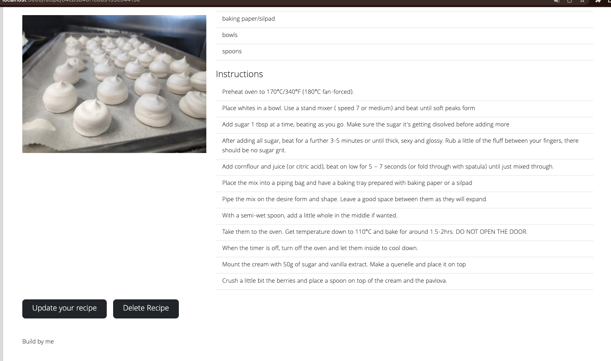

# Recipes everywhere project 2

# Intro
Unit two, project two.

We are reviewing the back end and CRUD functions. We were asked to have a simple web app where the main focus relies on CRUD functions and the management/creation of schemas for the database.

A bit more complex than the previous unit. However, a bit more interesting from my perspective.

# My app
[Recipes Anywhere](https://github.com/OsoSan01/RecipesAnywhere)

## Goals

    -Having an MVP by the end of the week.
    -Manage to have a full operating web app with CRUD functions.
    -Have fun doing a project that is relatable or interesting for me.

## Tools

-Node.js
    -I used express at the start. However, I decided to start a new project without the express structure

-MongoDB/Mongoose:
    -For managing the data base and schemas.

 -CSS
    -Used mainly bootstrap but added some aditional CSS to make it look better

 -JS
    -Only added this to handle the buttons to add elements on a list (more user friendly)

-Oauth  from Google
    -Authentication to let a user have their own data.

## Over view of the app

# How it works and what I used.

## General idea and pseudo code

In the beginning, I had two ideas: either try to replicate (a very bad one) a version of Twitter or try something more appealing to me. The second option won.

The idea behind this app is to have all your recipes available anytime, anywhere, if you are a chef or a cook. Sometimes looking for recipes online is not the best; using your own is the way to go.

The user will be able to log in. The categories and the last five recipes the user has submitted on the index page will be displayed.

The user can submit a new recipe or delete or update an existing one.

This time I didn't write pseudocode. Instead, I wrote and drew the different paths and connections that (in my mind) the page needed to have. (Some of them changed in the end).

Also, I wrote down some user stories. The same stories guided the app's functionality, what was meant to be rendered every time and how the database would handle the inputs/schemas:

 -I want to be able to create a recipe, add a picture and give it a category.
 -I want to see all the information and the picture of a recipe.
 -I want to have displayed the last five recipes I created.
 -I want to be able to update my existing recipe, with the previously input information there to be updated.
 -I want to be able to delete one of the recipes.

So, with all of that in mind and working...
  
Happy cooking!

# Problems and solutions and tricky parts.

Within the project, I encountered many troubles (mainly because of me):

First one:
	I kept forgetting to install, require and mount the necessary elements/frameworks (like multer from Cloudify or dotenv). 
Second:
	I need to remember to export the required elements.
Third:
	There are many moving parts in the back end, so more care is needed in how everything is connected.
Fourth:
	I couldn't make Cloudify work. As for now, the user can upload a picture of a recipe. That picture will be saved on the local computer.
Fifth:
	I tried to have an API giving random recipes. However, I need more study and understanding of how they work and how to implement them on a project.

## What I liked, what I hated, what's next

Overall, I'm quite happy with the result.

What I hated:

    -If I am not careful enough or plan correctly the paths, nothing will work.

What I liked:

    -Really enjoyed the back end perspective.

What will I improve:

    -Will continue working with this project as is part of something else I have in mind. 
    -For that, the connection with cloudify is a must. That will be fixed later on.
    -Also I will try to deploy it using Cyclic or Render.
    -Will add some API
    -Improve the UI

# Thanks and see you next unit!
